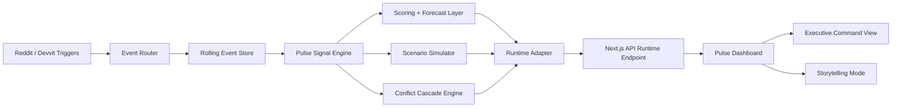

# Pulse Architecture

## Overview

Pulse is built as a layered moderation intelligence system:

1. Devvit-style triggers capture subreddit events.
2. Event routing normalizes those events into a rolling signal store.
3. The Pulse heuristic engine converts raw event pressure into community state.
4. Runtime adapters expose either simulated mode or live-ish mode.
5. The dashboard renders executive signals, simulations, forecasts, and cascades from one shared payload.

## Architecture diagram

## Devvit integration layer

The Devvit structure is intentionally separated so the prototype reads like a deployable moderation product:

- `devvit/index.ts`
  Registers the app, settings, triggers, and mod entrypoint.
- `devvit/config/settings.ts`
  Defines install-scoped and app-scoped configuration.
- `devvit/triggers/community-triggers.ts`
  Maps Reddit events into Pulse ingestion.
- `devvit/events/event-router.ts`
  Normalizes raw trigger payloads into Pulse events.
- `devvit/events/pulse-event-store.ts`
  Represents rolling subreddit runtime state.

## Runtime layers

### Simulated mode

Used for stable demos.

- deterministic signal seeds
- curated event bursts
- guided story presets
- predictable forecast behavior

### Live-ish mode

Used for technical credibility.

- rolling event ticks
- pressure accumulation
- realtime-style sync labels
- Devvit installation and permission status

## Heuristic engine

Pulse avoids real model training.

Instead it relies on:

- weighted event scoring
- moving pressure accumulation
- volatility and anomaly heuristics
- signal correlation
- temporal drift modeling
- action-to-outcome heuristics

## Why this is believable

- It mirrors the way moderators actually think: pressure, queue load, spillover, and community norms.
- It has a credible event ingestion story through Devvit.
- It separates signal collection from decision support.
- It never pretends to automate judgment away.
